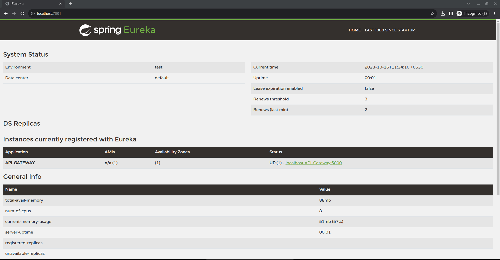

## Service Registry

> The Service Registry is a critical component in our microservices architecture, serving as a centralized service
> registry. It maintains a list of all available microservices, their locations, and health status. This registry allows
> other services to dynamically discover and communicate with each other, enabling seamless interactions in our
> distributed system.

## Purpose

The Service Registry serves the following purposes:

- Service Discovery: Enables services to find and communicate with each other without hardcoding service locations.
- Load Balancing: Distributes incoming traffic across multiple service instances to ensure optimal resource utilization.
- Health Checking: Monitors the health of registered services and removes unhealthy instances from the registry.
- Centralized Configuration: Provides a central configuration point for managing service endpoints.

## How to Access the Registry Service

The Service Registry is hosted at [localhost:7001](http://localhost:7001)

## Dashboard

## Topics covered in this demo

1. Distributed Tracing using Zipkin
2. Global Error/Exception Handling using Controller Advice
3. Generic DTO Validation(Fluent Validation)
4. Request/Response header validation using Gateway Filter
5. Resilience/Retry Policy using Resilience4J
6. Service Discovery using Spring Cloud
7. Health Check using Actuator